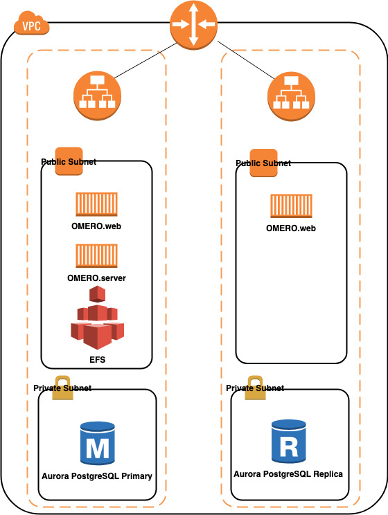

## digital-pathology-on-aws


## Deploy OMERO on AWS


The Hight Availability (HA) deployment of OMERO with single read write server can be used for 1-click deployment:

[](https://console.aws.amazon.com/cloudformation/home?region=us-east-1#/stacks/create/template?stackName=omerostack&templateURL=https://omero-on-aws.s3-us-west-1.amazonaws.com/OMEROstack_RW.yml)

The diagram of Architecture is here:


To install [AWS CLI](https://aws.amazon.com/cli/) and [omero-py](https://docs.openmicroscopy.org/omero/5.6.0/developers/Python.html) on the EC2 instance running OMERO server container, [run the following scripts](https://docs.aws.amazon.com/cli/latest/userguide/install-cliv2-linux.html)after login the instance:

```
curl "https://awscli.amazonaws.com/awscli-exe-linux-x86_64.zip" -o "awscliv2.zip"  
unzip awscliv2.zip  
sudo ./aws/install  
curl -LO https://anaconda.org/anaconda-adam/adam-installer/4.4.0/download/adam-installer-4.4.0-Linux-x86_64.sh  
bash adam-installer-4.4.0-Linux-x86_64.sh -b -p ~/adam  
echo -e '\n# Anaconda Adam\nexport PATH=~/adam/bin:$PATH' >> ~/.bashrc 
source ~/.bashrc  
conda install -c anaconda libstdcxx-ng -y 
conda install -c anaconda libgcc-ng -y  
conda create -n myenv -c ome python=3.6 bzip2 expat libstdcxx-ng openssl libgcc zeroc-ice36-python omero-py -y   
sudo yum install java-11-amazon-corretto-headless -y
source activate myenv
```

You can download image from AWS S3 using command:  
`aws s3 cp s3://xxxxxxxx.svs .`

and then use [OMERO client CLI](https://docs.openmicroscopy.org/omero/5.6.1/users/cli/index.html) on the EC2 instance to [import the image to OMERO](https://docs.openmicroscopy.org/omero/5.4.8/users/cli/import.html):  
`omero login`  
provide the DNSname:4046, root and omero
`omero import ./xxxxxx.svs`

Another Hight Availability (HA) deployment of OMERO with single read write server on ECS Fargate can be used for 1-click deployment:

[](https://console.aws.amazon.com/cloudformation/home?region=us-east-1#/stacks/create/template?stackName=omerostack&templateURL=https://omero-on-aws.s3-us-west-1.amazonaws.com/OMEROstackFargate_RW.yml)

The diagram of Architecture is here:



The following blog posts and tutorials can be used for references:
1. [Tutorial on EFS for ECS EC2 launch type](https://docs.aws.amazon.com/AmazonECS/latest/developerguide/tutorial-efs-volumes.html).  
2. [Blog post on EFS for ECS Fargate](https://aws.amazon.com/blogs/aws/amazon-ecs-supports-efs/).  
3. [Blog post on EFS as Docker volume](https://aws.amazon.com/blogs/compute/amazon-ecs-and-docker-volume-drivers-amazon-ebs/)


## Security

See [CONTRIBUTING](CONTRIBUTING.md#security-issue-notifications) for more information.

## License

This library is licensed under the MIT-0 License. See the LICENSE file.


