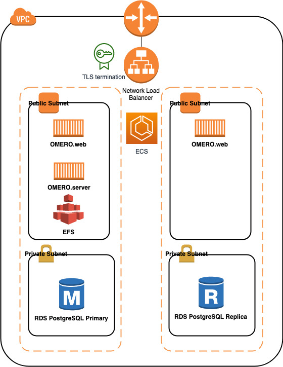

## Digital Pathology on AWS


### Deploy Open Source [OMERO](https://www.openmicroscopy.org/omero/) on AWS

[OMERO deployment](https://github.com/ome/omero-deployment-examples) is a typical three tier Web application. OMERO web and server are containerized and can run on [AWS ECS](https://aws.amazon.com/ecs). The data is stored in the [AWS EFS](https://aws.amazon.com/efs/) mounted to OMERO server and the [AWS RDS](https://aws.amazon.com/rds/) PostgreSQL database. Since current OMERO server only support one writer per mounted network share file, we will deploy only one read+write OMERO server in the following CloudFormation templates, otherwise there will be  a race condition between the two instances trying to own a lock on the network file share. Even though the OMERO server is deployed in single instance, we can achieve the Hight Availability (HA) deployment of OMERO web and PostgreSQL database.

The diagram of Architecture is here:



First create the network infrastructure. One way to do it is to deploy using [this CloudFormation template](https://docs.aws.amazon.com/codebuild/latest/userguide/cloudformation-vpc-template.html), which will create one [AWS VPC](https://aws.amazon.com/vpc/), two public subnets and two private subnets. If you want to add VPC flow logs, you can deploy [the network infrastructure CloudFormation template](https://github.com/aws-samples/digital-pathology-on-aws/blob/main/OMERO-cloudformation-templates/OMERONetworkInfra.yaml) in this repository and select true for AddVPCFlowLog parameter.

Next the OMERO stack can be deployed using this 1-click deployment:  
[](https://console.aws.amazon.com/cloudformation/home?region=us-east-1#/stacks/create/template?stackName=omerostack&templateURL=https://omero-on-aws.s3-us-west-1.amazonaws.com/OMEROstackFargateTLS_RW.yml)

which will deploy two nested CloudFormation templates, one for storage (EFS and RDS) and one for ECS containers (OMERO web and server). It also deploys a certificate for TLS termination at Network Load Balancer. Majority of parameters already have default values filled and subject to be customized. VPC and Subnets are required, which are from previous deployment. It also requires the Hosted Zone ID and fully qualifed domain name in [AWS Route53](https://aws.amazon.com/route53/), which will be used to validate SSL Certificate generated by [AWS Certificate Manager](https://aws.amazon.com/certificate-manager/).

If you want to connect to the instance that host the OMERO server container and run omero client CLI to import images on that instance, you can deploy the OMERO server container on ECS EC2 instance using 1-click deployment:  
[](https://console.aws.amazon.com/cloudformation/home?region=us-east-1#/stacks/create/template?stackName=omerostack&templateURL=https://omero-on-aws.s3-us-west-1.amazonaws.com/OMEROstackTLS_RW.yml)

Everything else other than the OMERO server running on EC2 instance is same as earlier CloudFormation template. To import whole slide images to OMERO server, you will need to install [AWS CLI](https://aws.amazon.com/cli/) and [omero-py](https://docs.openmicroscopy.org/omero/5.6.0/developers/Python.html) on the EC2 instance hosting OMERO server container, [run the following scripts](https://docs.aws.amazon.com/cli/latest/userguide/install-cliv2-linux.html) after login the instance:

```
curl "https://awscli.amazonaws.com/awscli-exe-linux-x86_64.zip" -o "awscliv2.zip"  
unzip awscliv2.zip  
sudo ./aws/install  
curl -LO https://anaconda.org/anaconda-adam/adam-installer/4.4.0/download/adam-installer-4.4.0-Linux-x86_64.sh  
bash adam-installer-4.4.0-Linux-x86_64.sh -b -p ~/adam  
echo -e '\n# Anaconda Adam\nexport PATH=~/adam/bin:$PATH' >> ~/.bashrc 
source ~/.bashrc  
conda install -c anaconda libstdcxx-ng -y 
conda install -c anaconda libgcc-ng -y  
conda create -n myenv -c ome python=3.6 bzip2 expat libstdcxx-ng openssl libgcc zeroc-ice36-python omero-py -y   
sudo yum install java-11-amazon-corretto-headless -y
source activate myenv
```

You can download image from AWS S3 using command:  
`aws s3 cp s3://xxxxxxxx.svs .`

and then use [OMERO client CLI](https://docs.openmicroscopy.org/omero/5.6.1/users/cli/index.html) on the EC2 instance to [import the image to OMERO](https://docs.openmicroscopy.org/omero/5.4.8/users/cli/import.html):  
`omero login`  
provide the DNSname:4046, root and omero
`omero import ./xxxxxx.svs`


If you do not have registered domain and public hosted zone in AWS Route53, you can deploy the following CloudFormation stacks and access to OMERO web through network load balancer DNS name without TLS termination. Again, you have two options: 

You can run all OMERO web and server containers on ECS Fargate using this 1-click deployment:  
[](https://console.aws.amazon.com/cloudformation/home?region=us-east-1#/stacks/create/template?stackName=omerostack&templateURL=https://omero-on-aws.s3-us-west-1.amazonaws.com/OMEROstackFargate_RW.yml)

or you can run OMERO server on ECS EC2 instance using this 1-click deployment:  
[](https://console.aws.amazon.com/cloudformation/home?region=us-east-1#/stacks/create/template?stackName=omerostack&templateURL=https://omero-on-aws.s3-us-west-1.amazonaws.com/OMEROstack_RW.yml)


The following information was used to build this solution:
1. [OMERO Docker](https://github.com/ome/docker-example-omero)
2. [OMERO deployment examples](https://github.com/ome/omero-deployment-examples)
3. [Deploying Docker containers on ECS](https://docs.docker.com/cloud/ecs-integration/)
4. [Tutorial on EFS for ECS EC2 launch type](https://docs.aws.amazon.com/AmazonECS/latest/developerguide/tutorial-efs-volumes.html).  
5. [Blog post on EFS for ECS Fargate](https://aws.amazon.com/blogs/aws/amazon-ecs-supports-efs/).  
6. [Blog post on EFS as Docker volume](https://aws.amazon.com/blogs/compute/amazon-ecs-and-docker-volume-drivers-amazon-ebs/)


## Security

See [CONTRIBUTING](CONTRIBUTING.md#security-issue-notifications) for more information.

## License

This library is licensed under the MIT-0 License. See the LICENSE file.


