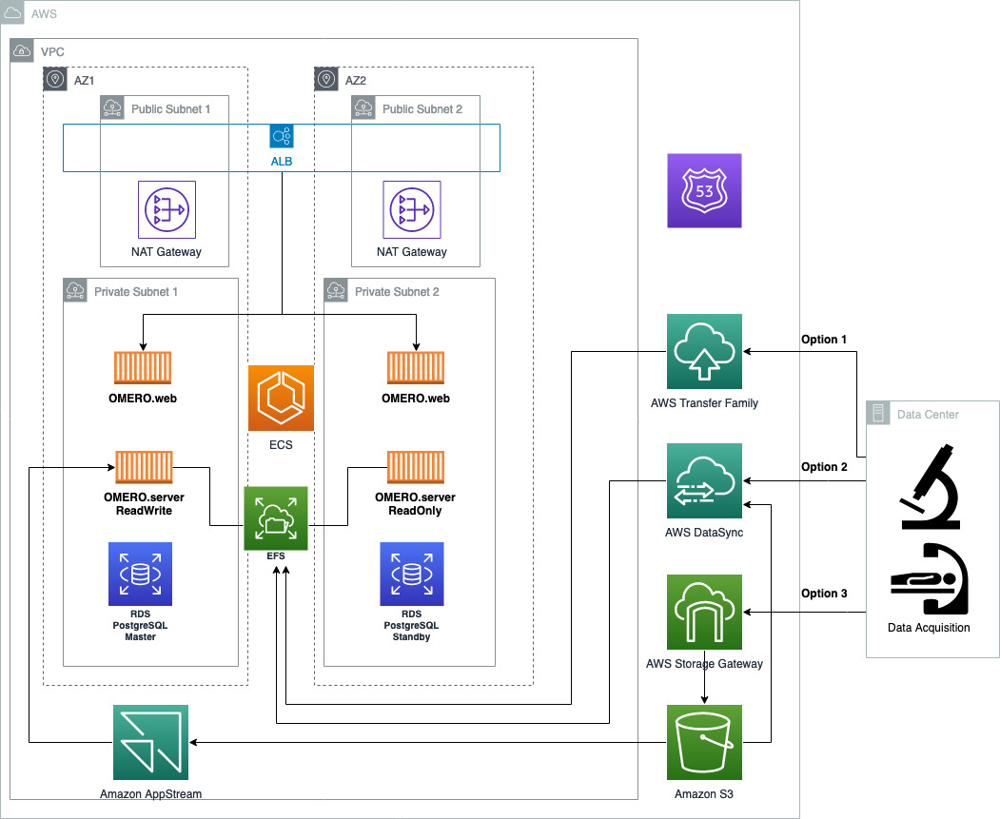

# Digital Pathology on AWS

## Contents
  
* [OMERO on AWS](#omero-on-aws)  
* [Overview](#overview) 
* [OMERO Stack Deployment Options](#deployment-options-for-omero-stack)
* [OMERO Core Stack Cost Estimate](#omero-core-stack-cost-estimate)
* [OMERO Data Ingestion Options](#omero-data-ingestion-options)
* [Transfer Image Data into EFS](#transfer-image-data-into-efs)
* [Transfer Image Data using Storage Gateway](#transfer-image-data-using-storage-gateway)
* [Cost Estimate for Storage](#cost-estimate-for-storage)
* [Amazon S3 File Gateway Deployment](#amazon-s3-file-gateway-deployment)
* [Deployment Architecture with only RW Omero Server on EC2, leveraging Amazon S3 File Gateway](#deployment-architecture-with-only-rw-omero-server-on-ec2-leveraging-amazon-s3-file-gateway)
* [Run Amazon ECS Exec Command to Import Images](#run-amazon-ecs-exec-command-to-import-images)
* [Automated File Import using OMERO DropBox on ECS/EC2](#automated-file-import-using-omero-dropbox-on-ecs/ec2)
* [OMERO insight on AppStream](#omero-insight-on-appstream)
* [OMERO CLI on EC2](#omero-cli-on-ec2)
* [OMERO Server Container Application Logs in CloudWatch](#omero-server-container-application-logs-in-cloudwatch)
* [OMERO Application Monitoring Dashboard in CloudWatch](#omero-application-monitoring-dashboard-in-cloudwatch)
* [Clean Up the deployed stack](#clean-up)
* [Reference](#reference)
* [Security](#security)
* [License](#license)
* [Disclaimer](#disclaimer)

-----
## OMERO on AWS

[OMERO](https://www.openmicroscopy.org/omero/) is an open source microscopic image management tool. [OMERO deployment](https://github.com/ome/omero-deployment-examples) is a typical three tier Web application. OMERO web and server are containerized and can run on [AWS ECS](https://aws.amazon.com/ecs). The data is stored in the [AWS EFS](https://aws.amazon.com/efs/) mounted to OMERO server and the [AWS RDS](https://aws.amazon.com/rds/) PostgreSQL database. [Amazon EFS Intelligent-tiering](https://aws.amazon.com/blogs/aws/new-amazon-efs-intelligent-tiering-optimizes-costs-for-workloads-with-changing-access-patterns/) can reduce the storage cost for workloads with changing access patterns.

-----
## Overview

First create the network infrastructure. One way to do it is to deploy using [this CloudFormation template](https://docs.aws.amazon.com/codebuild/latest/userguide/cloudformation-vpc-template.html), which will create one [AWS VPC](https://aws.amazon.com/vpc/), two public subnets and two private subnets. If you want to add [VPC flow logs](https://docs.aws.amazon.com/vpc/latest/userguide/flow-logs.html), you can deploy [the network infrastructure CloudFormation template](https://github.com/aws-samples/digital-pathology-on-aws/blob/main/OMERO-cloudformation-templates/OMERONetworkInfra.yaml) in this repository and select true for AddVPCFlowLog parameter.

If you have registered or transfer your domain to AWS Route53, you can use the associated Hosted zones to [automate the DNS validatition for the SSL certificate](https://aws.amazon.com/blogs/security/how-to-use-aws-certificate-manager-with-aws-cloudformation/) issued by [AWS Certificate Manager (ACM)](https://aws.amazon.com/certificate-manager/). It is noteworthy the Route53 domain and associated public Hosted zone should be on the same AWS account as the ACM that issues SSL certificate, in order to automate the DNS validation. ACM will create a validation CNAME record in the public Hosted zone. This DNS validated public certificate can be used for [TLS termination for Applicaton Load Balancer](https://docs.aws.amazon.com/elasticloadbalancing/latest/application/create-https-listener.html)

-----

## Deployment Architecture


-----
## Deployment options for OMERO Stack

1. Quick Start - **Deployment Architecture with RW and RO Omero Server**
    - Current OMERO server only support one writer per mounted network share file. To avoid a race condition between the two instances trying to own a lock on the network file share, we will deploy one read+write OMERO server and one read only OMERO server. 
    - Stack will deploy two nested CloudFormation templates, one for storage (EFS and RDS) and one for ECS containers (OMERO web and server). It also deploys a certificate for TLS termination at Application Load Balancer. Majority of parameters already have default values filled and subject to be customized. VPC and Subnets are required, which can be obtained from pre-requisite deployment. It also requires the Hosted Zone ID and fully qualifed domain name in [AWS Route53](https://aws.amazon.com/route53/), which will be used to validate SSL Certificate issued by [AWS ACM](https://aws.amazon.com/certificate-manager/). 
    - Choose Launch Stack and (if prompted) log into your AWS account:

        [](https://console.aws.amazon.com/cloudformation/home?region=us-east-1#/stacks/create/template?stackName=omerostack&templateURL=https://omero-on-aws.s3-us-west-1.amazonaws.com/OMEROstackTLS_RW_RO.yml)

2. Quick Start - **Deployment Architecture with only RW Omero Server**
    - If you do not need the redundency for read only OMERO server, you can deploy a single read+write OMERO server.
    - Choose Launch Stack and (if prompted) log into your AWS account: 

        [](https://console.aws.amazon.com/cloudformation/home?region=us-east-1#/stacks/create/template?stackName=omerostack&templateURL=https://omero-on-aws.s3-us-west-1.amazonaws.com/OMEROstackTLS_RW.yml)  

    - Note: Even though the OMERO server is deployed in single instance, you can achieve the Hight Availability (HA) deployment of OMERO web and PostgreSQL database. You have option to deploy the OMERO containers on ECS Fargate or EC2 launch type.

 
3. **Deployment Architecture with only RW Omero Server with ingress access**
    - If you want to expose the OMERO server port, i.e. 4064 and 4063, to public, you can deploy a stack with [Network Load Balancer (NLB)](https://aws.amazon.com/elasticloadbalancing/network-load-balancer/) for those two ports
    - Choose Launch Stack and (if prompted) log into your AWS account: 
    
        [](https://console.aws.amazon.com/cloudformation/home?region=us-east-1#/stacks/create/template?stackName=omerostack&templateURL=https://omero-on-aws.s3.us-west-1.amazonaws.com/OMERO2LBstackTLS_RW.yml)  

4. **Deployment Architecture with only RW Omero Server without hosted zone in AWS**
    - If you do not have registered domain and associated hosted zone in AWS Route53, you can deploy the following CloudFormation stacks and access to OMERO web through Application Load Balancer DNS name without TLS termination.  
    - Choose Launch Stack and (if prompted) log into your AWS account: 
    
        [](https://console.aws.amazon.com/cloudformation/home?region=us-east-1#/stacks/create/template?stackName=omerostack&templateURL=https://omero-on-aws.s3-us-west-1.amazonaws.com/OMEROstack_RW.yml)

----

## Omero Core Stack Cost Estimate

- A cost estimate for the compute resources deployed by this solution can be found [here](https://calculator.aws/#/estimate?id=15abc33f2c524886f08547f2f48e66dee7112955).

----

## OMERO Data Ingestion Options

There are multiple ways to ingest image data into OMERO on AWS:
1. Transfer data directly to EFS mounted to OMERO server through [AWS Transfer Family](https://aws.amazon.com/aws-transfer-family/), from on premises data center or data acquisition facilities.
2. Transfer data to EFS through [AWS DataSync](https://aws.amazon.com/datasync/), either from on premises data acquisition or from [Amazon S3](https://aws.amazon.com/s3/).
3. Upload data to [Amazon S3](https://aws.amazon.com/s3/) first through [AWS Stroage Gateway](https://aws.amazon.com/storagegateway/) or other tools, then import into OMERO using virtualized [OMERO.insight](https://github.com/ome/omero-insight) desktop application accessed through [Amazon AppStream 2.0](https://aws.amazon.com/appstream2)

----

## Transfer Image Data into EFS

There are [two primary ways to land image data into EFS file share](https://docs.aws.amazon.com/efs/latest/ug/transfer-data-to-efs.html), using [AWS DataSync](https://docs.aws.amazon.com/efs/latest/ug/gs-step-four-sync-files.html) or [AWS Transfer Family](https://aws.amazon.com/blogs/aws/new-aws-transfer-family-support-for-amazon-elastic-file-system/). 

1. AWS DataSync can be used to [transfer data from S3](https://aws.amazon.com/premiumsupport/knowledge-center/datasync-transfer-efs-s3/) as well.
2. You can create a DataSync task to monitor a S3 bucket and copy the files over to the EFS file share mounted to OMERO server using 1-click deployment:
3. Choose Launch Stack and (if prompted) log into your AWS account: 

    [](https://console.aws.amazon.com/cloudformation/home?region=us-east-1#/stacks/create/template?stackName=omerodatasyncstack&templateURL=https://omero-on-aws.s3.us-west-1.amazonaws.com/OMERO_DataSync.yaml) 

----

## Transfer Image Data using Storage Gateway
If you have huge amount of data and I/O performance is not critical, you can save the image files on Amazon S3 and deploy a S3 filegateway on Amazon EC2 to cache a subset of files, and mount a NFS file share instead of Amazon EFS volume to OMERO server. Although Amazon S3 cost significantly less than Amazon EFS, the file gateway instance does have the extra cost. 


----
## Cost Estimate for Storage
Review the storage cost comparison for 2TB of data between Amazon EFS with intelligent tiering and Amazon S3 with filegateway on EC2
- [Amazon EFS with intelligent tiering](https://calculator.aws/#/estimate?id=bbaac0d5d38a5c2d457848cae5745cdbbfeddb92) 
- [Amazon S3 with filegateway on EC2](https://calculator.aws/#/estimate?id=688458e015f93858a005995d91597775bf67731f)

----
## Amazon S3 File Gateway Deployment

You can follow the [instruction to deploy an Amazon S3 File gateway on EC2](https://docs.aws.amazon.com/storagegateway/latest/userguide/ec2-gateway-file.html) to cache the images in S3 bucket to reduce storage cost. Alternatively, you can follow the below steps to deploy and configure Amazon S3 File Gateway.

1. Cloudformation template will create a EC2 File Gateway and S3 bucket for storing the images in an S3 Bucket.

2. Choose Launch Stack and (if prompted) log into your AWS account: 

    [](https://console.aws.amazon.com/cloudformation/home?region=us-east-1#/stacks/create/template?stackName=s3filegatewayinstance&templateURL=https://omero-on-aws.s3-us-west-1.amazonaws.com/ec2s3filegateway.yaml)

3. Once the stack is deployed you should have an EC2 Instance that you can now use to configure your Amazon S3 File Gateway. Navigate to the [File Gateway](https://us-east-1.console.aws.amazon.com/storagegateway/home?region=us-west-1#/gateways/create) on AWS Console and specify a name and appropriate time zone and select Gateway type of Amazon S3 File Gateway.

    

4. Connect to the EC2 file gateway instance through IP address and activate it. Follow [instruction](https://docs.aws.amazon.com/storagegateway/latest/userguide/create-gateway-file.html#GettingStartedBeginActivateGateway-file) to configure local disks and logging.

5. Create a [NFS file share](https://docs.aws.amazon.com/storagegateway/latest/userguide/CreatingAnNFSFileShare.html) on top of the S3 bucket created earlier. If you want to upload files to S3 bucket separately and have them visible to the NFS share, you should configure the cache refresh:

    

6. If you want to make all of the files uploaded to S3 visible as owned by **omero-server** within container mounted to the storage gateway, you can make the following change to the new file share created:

    

7. After storage gateway setup, you can revoke the storage gateway EC2 instance security group ingress rule for port 80, which is only used for storage gateway activation. 

    


----
## **Deployment Architecture with only RW Omero Server on EC2, leveraging Amazon S3 File Gateway**
1. Note the two parameters from the S3 File Gateway deployment: **S3FileGatewayIp** and **S3BucketName**.
2. Deploy OMERO stack with NFS mount as storage backend through this 1-click deployment:

    [](https://console.aws.amazon.com/cloudformation/home?region=us-east-1#/stacks/create/template?stackName=omerostack&templateURL=https://omero-on-aws.s3-us-west-1.amazonaws.com/OMEROonECS_RW_S3FG.yml)

3. Deploy OMERO stack with NFS mount as storage backend through this 1-click deployment with a domain name and SSL certificate:

    [](https://console.aws.amazon.com/cloudformation/home?region=us-east-1#/stacks/create/template?stackName=omerostack&templateURL=https://omero-on-aws.s3.us-west-1.amazonaws.com/OMEROonECS_RW_TLS_S3FG.yml)

-----
## Run Amazon ECS Exec Command to Import Images

1. Once image data landed on EFS, you can access and import them into OMERO using Command Line Interface (CLI). [Amazon ECS Exec command has been enabled](https://docs.aws.amazon.com/AmazonECS/latest/developerguide/ecs-exec.html) for OMERO.server container service. 
2. Note: To run ECS Exec command on Fargate containers, you should have AWS CLI v1.19.28/v2.1.30 or later installed first, and install [SSM plugin for AWS CLI](https://docs.aws.amazon.com/systems-manager/latest/userguide/session-manager-working-with-install-plugin.html). 
2. Setup steps:

    - Grab your ECS task ID of OMERO server on AWS ECS Console, and run:  

        ```bash
        aws ecs execute-command --cluster OMEROECSCluster --task <your ECS task Id> --interactive --command "/bin/sh"
        ``` 

    - If you failed to execute the command, you can use the [diagnosis tool](https://github.com/aws-containers/amazon-ecs-exec-checker) to check the issue. 

    -   After login, you will need to change to a non-root OMERO system user, like `omero-server`, and activate the virtual env:

        ```bash
        source /opt/omero/server/venv3/bin/activate
        ``` 

    - After environment activated, you can run [in-place import](https://docs.openmicroscopy.org/omero/5.6.1/sysadmins/in-place-import.html) on images that have already been transfered to the EFS mount, like `omero import --transfer=ln_s <file>`. It is noteworthy that the [OMERO CLI importer](https://omero-guides.readthedocs.io/en/latest/upload/docs/import-cli.html#in-place-import-using-the-cli) has to run on the OMERO server container.

    - **If you deployed OMERO server on EC2 launch type**, you can run docker commands to import images as well. Assuming you want to import all of the images in `/OMERO/downloads`:

        ```bash
        containerID=`docker ps | grep omeroserver | awk '{print $1;}'`
        files=`docker exec $containerID bash -c "ls /OMERO/downloads"`
        for FILE in $files; do docker exec $containerID bash -c "source /opt/omero/server/venv3/bin/activate; omero import -s localhost -p 4064 -u root --transfer=ln_s /OMERO/downloads/$FILE"; done
        ```

----
## Automated File Import using OMERO DropBox on ECS/EC2

OMERO supports automated file import using [DropBox](https://omero-guides.readthedocs.io/en/latest/upload/docs/import-dropbox.html). OMERO.dropbox allows to import files into OMERO automatically, by means of offline import from a watched directory.

1. Assuming that you have already exec into the omero-server container.
2. You can create a folder in the `/OMERO/DropBox` directory with folder name as username, like:
    ```bash
    mkdir /OMERO/DropBox/root
    ```

3. Then run the following commands to create the automated import job on OMERO server:
    ```bash
    export OMERODIR=/opt/omero/server/OMERO.server
    $OMERODIR/bin/omero config set omero.fs.watchDir "/OMERO/DropBox"
    $OMERODIR/bin/omero config set omero.fs.importArgs '-T "regex:^.*/(?<Container1>.*?)"'
    ```

4. You can check if jobs are created successfully, by checking `/opt/omero/server/OMERO.server/var/log/DropBox.log` file, you should see something like: `Started OMERO.fs DropBox client`

5. According to the [documentation](https://docs.openmicroscopy.org/omero/5.6.3/sysadmins/dropbox.html), you can add different arguments, like for in-place import: 
    ```bash
    $OMERODIR/bin/omero config set omero.fs.importArgs '-T "regex:^.*/(?<Container1>.*?)"; --transfer=ln_s'
    ```
    or to check if a given path has already been imported beforehand (avoid duplicate import):
    ```bash
    $OMERODIR/bin/omero config set omero.fs.importArgs '-T "regex:^.*/(?<Container1>.*?)"; --exclude=clientpath'
    ```

----
## OMERO insight on AppStream

Here are steps to run [OMERO.insight](https://docs.openmicroscopy.org/omero/5.6.1/users/clients-overview.html#omero-insight) on Amazon AppStream 2.0, which can import data from Amazon S3 directly into OMERO server:

1. Follow [instruction](https://docs.aws.amazon.com/appstream2/latest/developerguide/tutorial-image-builder.html) to create a custom image using AppStream console. The Windows installation file can be [downloaded here](https://www.openmicroscopy.org/omero/downloads/). Launch image builder and start with any of the Windows base images, select size of instance, either create a new or use existing IAM role with S3 access permission. Select the VPC where OMERO stack was deployed, and a public subnet that can be access through internet. The image builder instance will be stopped after image building.

    

    Once image is successfully created, you will find it in Image Registry:

    

2. Follow [instructions](https://docs.aws.amazon.com/appstream2/latest/developerguide/set-up-stacks-fleets.html) to create a fleet and a stack. When you create the fleet, select the VPC where OMERO stack was deployed, two public subnets that can be access through internet, and OMERO security group that allow access to OMERO server.

    

    When you create the stack, [enable the Home Folder in Amazon S3](https://docs.aws.amazon.com/appstream2/latest/developerguide/home-folders.html), then you will be able to import image files from S3 directly to OMERO server.

    

3. Create a user in the AppStream 2.0 User Pool, and access OMERO.insight through the streaming service using the login URL in the email or created for the given stack. Once access the virtualized OMERO.insight on AppStream 2.0, you can access the home folder on S3 and setup OMERO server connection.
    
    

    The OMERO server container instance has been assigned with a private IP address by [awsvpc network model](https://docs.aws.amazon.com/AmazonECS/latest/developerguide/task-networking.html) in this deployment. The IP address can be found on AWS console ECS Cluster => Task => Task detail page:  

    

    


----
## OMERO CLI on EC2

**It is noteworthy that the OMERO CLI cannot perform in-place import on separate EC2 instance.**

1. If you want to run OMERO CLI client on another EC2 instance to transfer and import images from [Amazon S3](https://aws.amazon.com/s3/), you can use this 1-click deployment:

    [](https://console.aws.amazon.com/cloudformation/home?region=us-east-1#/stacks/create/template?stackName=omeroec2loader&templateURL=https://omero-on-aws.s3-us-west-1.amazonaws.com/omero_ec2_uploader_template.yaml) 

2. You can reuse the EFSFileSystem Id, AccessPoint Id, EFSSecurityGroup, OmeroSecurityGroup, PrivateSubnetId, and VPCID from the aforementioned deployments. EC2 instance have installed [AWS CLI](https://aws.amazon.com/cli/), [Amazon Corretto 11](https://docs.aws.amazon.com/corretto/latest/corretto-11-ug/what-is-corretto-11.html), and [omero-py](https://docs.openmicroscopy.org/omero/5.6.0/developers/Python.html), using [AWS EC2 user data shell scripts](https://docs.aws.amazon.com/AWSEC2/latest/UserGuide/user-data.html). To import microscopic images to OMERO server, you can connect to the EC2 instance using Session Manager (login as ssm-user) and run:  

    ```bash
    source /etc/bashrc   
    conda create -n myenv -c ome python=3.6 bzip2 expat libstdcxx-ng openssl libgcc zeroc-ice36-python omero-py -y   
    source activate myenv
    ```

3. You can download image from AWS S3 using command:  
    ```bash
    aws s3 cp s3://xxxxxxxx.svs .
    ```

    and then use [OMERO client CLI](https://docs.openmicroscopy.org/omero/5.6.1/users/cli/index.html) on the EC2 instance to [import the image to OMERO](https://docs.openmicroscopy.org/omero/5.4.8/users/cli/import.html):  

    ```bash
    omero login
    ```  

4. The IP address of the OMERO server can be found in the same way demonstrated above. The default port number is 4064, and default username (root) and password (omero) for OMERO are used here. Once you login, you can import whole slide images, like:  

    `omero import ./xxxxxx.svs`

----
## OMERO Server Container Application Logs in CloudWatch 

Note: **Option valid for ECS/EC2 deployment only**.

Omero server container has multiple applications running that generate logs that are not streamed to STDOUT and STDERR I/O streams and are a result not available on CloudWatch. Reviewing the application logs from within the container is not ideal since this would require manual steps and prevent being reactive to events in application log. 

In order to limit changes to the Omero Server opensource code and change the default log4j configurations and to also support easier path to upgrade and maintenance, one of the options is to make the application logs from the container available on EC2 and use [CloudWatch Log Agent](https://docs.aws.amazon.com/AmazonCloudWatch/latest/monitoring/Install-CloudWatch-Agent.html) to send these logs to CloudWatch that can persist beyond the life of the container and also provide better observability into the Omero Server container application.

CFN template automates the deployment of the CloudWatch log configuration for omero server. Steps involved for the automation are the following:
1. Omero server logs from the container are mounted to the host on the `/var/log/omero` directory with appropriate permissions. Please modify the permissions based on your organization's best practices.
2. CloudWatch log agent configuration provides the default log files to be monitored and the configuration is stored in SSM parameter store. Please update the configuration based on the additional log files that you want to ingest into CloudWatch. Additional CloudWatch Log Agent configuration options are described [here](https://docs.aws.amazon.com/AmazonCloudWatch/latest/monitoring/CloudWatch-Agent-common-scenarios.html)
3. Omero server task definition is configured for the bind mount and associated volume mapping to the container.
4. Once the task is running you should start seeing the logs on CloudWatch.

    Omero Server Logs in CloudWatch.

    

    Omero Server Blitz Log in CloudWatch by EC2 Instance.
    
    

----
## OMERO Application Monitoring Dashboard in CloudWatch
Omero Application Dashboard is deployed as part of the application deployment. The monitoring dashboard will vary depending on the ECS deployment that is chosen. If you do choose the deploy the Omero Server Container on ECS/EC2 the dashboard will include EC2 metrics in addition to the ALB, Database, ECS Cluster and Container Insights metrics. If you do want to extend the metrics captured in the dashboard please review the `OMEROonECS_Monitoring.yaml` templates for additional customization including any alarm configurations.

Sample OMERO Application Dashboard available on CloudWatch.


----
## Clean Up

1. If you deployed with SSL certificate, go to the HostedZone in Route53 and remove the validation record that route traffic to _xxxxxxxx.xxxxxxxx.acm-validations.aws.
2. Empty and delete the S3 bucket for Load Balancer access log (LBAccessLogBucket in the template) before deleting the OMERO stack
3. Manually delete the EFS file system and RDS database. By default the storage retain after the CloudFormation stack is deleted.

----
## Reference 

The following information was used to build this solution:
1. [OMERO Docker](https://github.com/ome/docker-example-omero)
2. [OMERO deployment examples](https://github.com/ome/omero-deployment-examples)
3. [Deploying Docker containers on ECS](https://docs.docker.com/cloud/ecs-integration/)
4. [Tutorial on EFS for ECS EC2 launch type](https://docs.aws.amazon.com/AmazonECS/latest/developerguide/tutorial-efs-volumes.html)
5. [Blog post on EFS for ECS Fargate](https://aws.amazon.com/blogs/aws/amazon-ecs-supports-efs/)
6. [Blog post on EFS as Docker volume](https://aws.amazon.com/blogs/compute/amazon-ecs-and-docker-volume-drivers-amazon-ebs/)


----
## Security

See [CONTRIBUTING](CONTRIBUTING.md#security-issue-notifications) for more information.

----
## License

This library is licensed under the MIT-0 License. See the LICENSE file. 

----
## Disclaimer

This deployment was built based on the [open source version of OMERO](https://www.openmicroscopy.org/licensing/). OMERO is licensed under the terms of the GNU General Public License (GPL) v2 or later. Please note that by running Orthanc under GPLv2, you consent to complying with any and all requirements imposed by GPLv2 in full, including but not limited to attribution requirements. You can see a full list of requirements under [GPLv2](https://opensource.org/licenses/gpl-2.0.php).