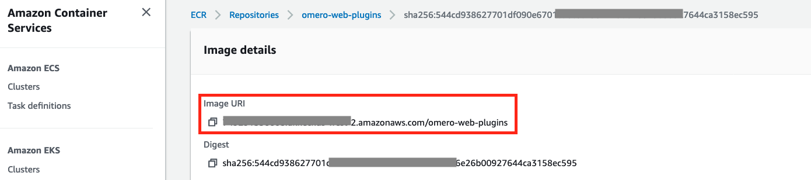

## Build Customer Container Image with Plugins

You can build customized container images for [OMERO.web](https://github.com/ome/omero-web-docker) and [OMERO.server](https://github.com/ome/omero-server-docker) by running the script:

`sh build_and_push.sh ` 

It will build the docker image and upload it to [AWS ECR](https://aws.amazon.com/ecr/). Take a note of the image URL after uploading:

and fill it in the CloudFormation deployment parameters: OMEROWebContainerImageParam or OMEROServerContainerImageParam

### Disclaimer

The containers were built from the [open source version of OMERO](https://github.com/ome/omero-web-docker). OMERO plugins are licensed under the terms of the GNU General Public License (GPL) v2 or later. Please note that by running Orthanc under GPLv2, you consent to complying with any and all requirements imposed by GPLv2 in full, including but not limited to attribution requirements. You can see a full list of requirements under [GPLv2](https://opensource.org/licenses/gpl-2.0.php).
